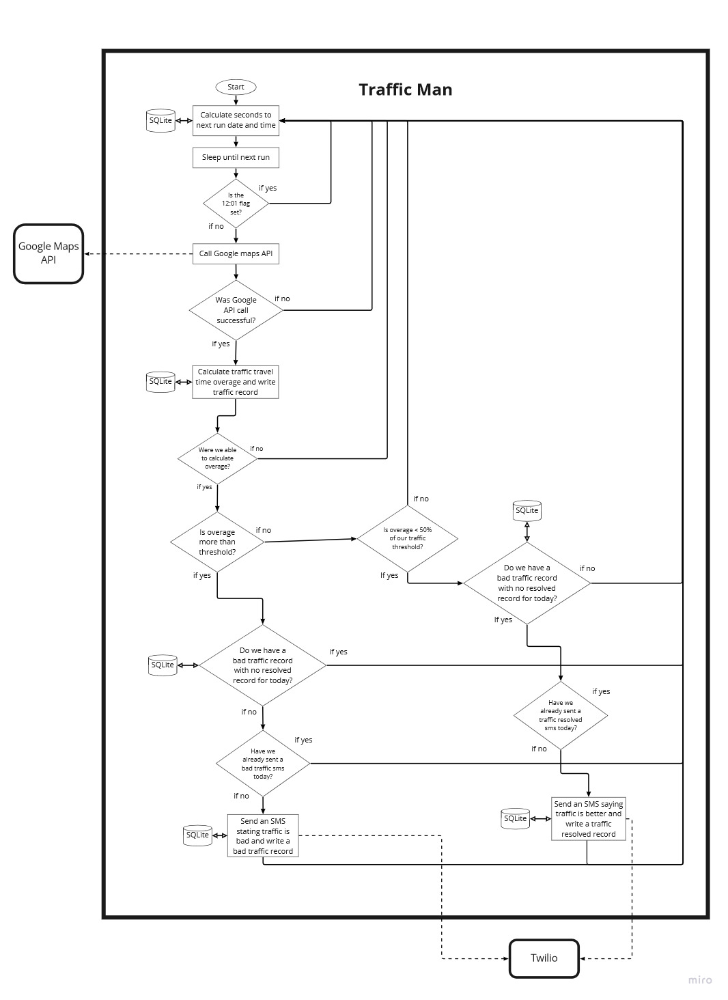
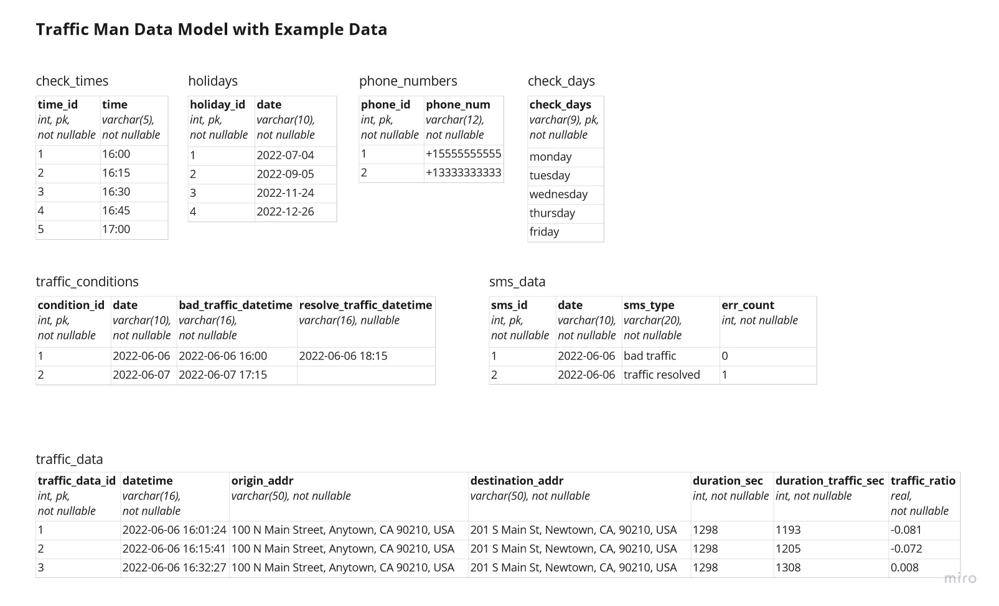

# traffic-man
## Overview
traffic man is a dockerized application that checks for bad traffic conditions between two points using the Google Maps API on set days and times and sends SMS notifications when traffic conditions exceed a configurable threshold using Twilio.  
  
__Highlights__  
 - SQLite for storing parameters, traffic data, and SMS send history
 - Tested to run with both Python 3.9 and 3.10
 - Docker and docker compose for build and deployment
 - Base image python:3.10.1-slim-bullseye
 - Uses the Google Maps Distance Matrix API (paid service) to retrieve traffic conditions
 - Twilio's Messaging API provides the SMS messaging functionality (also, a paid service)

## Prerequisites
 - Google account with Google Maps' Distance Matrix API enabled
 - Twilio account with SMS setup
 - A linux host machine with docker and docker compose installed to build and run the application image

## Quick start guide
 - Clone this repository to a machine with docker and docker compose installed
 - Create a .env file by copying and renaming the included .env-template
     - Replace all of the example values with your own.
 - Update /src/traffic_man/config.py
     - Adjust the `overage_parameter` value to whatever you want. The default is set to 0.5, which means that a bad traffic SMS will be sent when the travel time with traffic is 50% more than the standard travel time. This value should be greater than 0, and should be expressed as a decimal number.
         - Once the bad traffic threshold is passed, traffic man will look for travel time to drop below 50% of the bad traffic threshold. If traffic man identifies that travel time has dropped below that threshold, it will send another SMS indicating that traffic conditions are improving.  __Example:__ If your overage parameter is set at 0.5, once the travel time with traffic exceeds 1.5 times the normal travel time, a bad traffic SMS message will send. Once the travel time with traffic drops below 1.25 times the normal travel time, a traffic resolved SMS message will be sent.  
           
           
         __Note:__ Traffic man will only send one bad traffic SMS and one traffic resolved SMS per day. If traffic conditions oscillate back and forth several times around the overage parameter, traffic man will not continue to send SMS messages beyond one of each type.
     - Set the `traffic_check_times` variable. This indicates what time each day you want traffic man to check traffic conditions. The default setup will check every 15 minutes starting at 4:00 PM (16:00), with the last check at 7:00 PM (19:00).
    - Update the `holidays` variable to include any holidays you want, so traffic man won't check traffic conditions on those days.
    - Change the `traffic_check_days` variable to set the days of the week you want traffic man to check traffic conditions
 - Edit the Dockerfile
     - Edit `ENV TZ=America/Chicago` to match your timezone.
 - Edit docker-compose.yml
     - Optionally, you can edit or remove the `dns` directive. If you do not run a DNS server on your local network, you can probably just remove this.
 - Build the docker image
     - On the host machine that will run traffic man, turn on docker buildkit with `export DOCKER_BUILDKIT=1`
     - Move into the root of this project and run `docker build -t traffic-man:latest .` to build the docker image
 - Start the application
     - While still in the root of this project run `docker-compose up -d` to start the traffic man container
     - A docker volume will be setup to perist the SQLite .db file and the log file
     - Run `docker ps` to verify that your container is running

## How it works

__Process diagram__  

   
 &nbsp;
 &nbsp;  

 __Data model__  
   
 &nbsp;

## Development and testing

### Setting up your dev environment

#### Envirionment variables
 - In the root of this project, create a .env file by copying and renaming the provided .env-template file. 
 - Edit your .env file, changing out the example values for yours.
    - You will get your Google API key, Twilio account SID, Twilio auth token from those repecitive accounts
    - Place IDs are Google's unique identifiers for specific addresses in Google Maps. To find the place ID of address, go to https://developers.google.com/maps/documentation/places/web-service/place-id. Once your have your origin and destination place IDs, you can copy and paste them into your .env file.
    - PHONE_NUMS is the a list of phone numbers you want to send SMS messages to. Phone numbers must follow the format of `+<country code><phonenumber including area code>` with no spaces or dashes. To include more than one phone number, separate them with a pipe symbol `|`.
    - The FROM_NUM variable will be the from phone numbers setup in your Twilio account, and will need to follow the same format as the other phone numbers.
    - Change the TRAFFIC_MAN_ENV variable to `dev`, so the log and db file will be stored in the project directory.  
    __Note:__ You will want to change this valud back to `prod` before building your docker image.
 - Before running traffic man, you need to export all of the variables you just set into your environment.
     - If you are using using bash (or gitbash), run this command `export $(grep -v '^#' .env | xargs)`  
__Note:__ Never put your real API keys and phone numbers in the .env-template file. The .env file is included in our .gitignore file, and will not be committed to our git history. .env-template is part of the poject, and will be commited to git history.

#### Install traffic man
 - It is recommended that you use python vertual environments to keep your dev environment clean.
 - With your desired python virtual environment active navigate to the root of this project in your terminal of choice.
 - Run `pip install -e .[dev]` to install traffic man, its dependencies, and testing tools.
 - To start traffic man you can run `start-traffic-man` in your termainal.  
 __Note:__ This will run the full application and start printing log statements to the screen. It will also call the Google Maps and Twilio APIs with the crendentials you provided, wihch could result in charges to your account.
     

### Testing
 - Run the suite of unit tests and record test coverage for reporting with `coverage run --source=src -m unittest discover -v -s tests/unit`
 - Generate an html report to see which modules and lines have test coverage using `coverage html`
     - You can now navigate to the htmlcov directory that was created, and open the index.html file in your browser to see a report of test coverage and which lines of code still need to be covered (highlighted in red).
 - The .gitlab-ci.yml file included in this project is used to automate testing accross multiple environments on a private Gitlab server. This file could be modified for use on your own Gitlab server or gitlab.com, but will have no effect on Github.