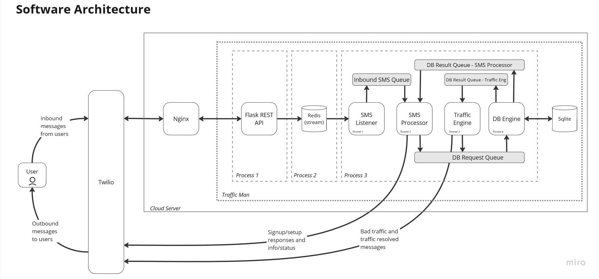
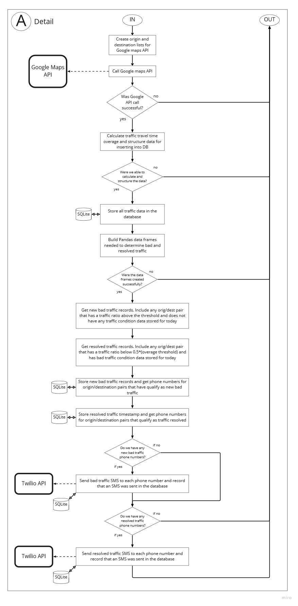

# traffic-man

## Overview
traffic-man is a dockerized application that checks for bad traffic conditions between two points using Google's Distance Matrix API on set days and times and sends SMS notifications to users when traffic conditions exceed a configurable threshold using Twilio. Users authenticate and setup their profile via SMS. traffic-man uses Google's Places API to search for addresses and place ids based on user provided search terms. 
  
__Highlights__  
 - SQLite for storing user information, traffic data, and SMS logs
 - Tested to run with both Python 3.9 and 3.10
 - Using docker and docker compose for build and deployment
 - Base image python:3.10.1-slim-bullseye
 - The Google Maps Distance Matrix API is used to retrieve traffic conditions (paid service, but you get $200/month in requests for free)
 - Google's Places API facilitates searching for address and place ids (paid service, but you get $200/month in requests for free)
 - Twilio's Messaging API provides the SMS messaging functionality (paid service)
 - Redis' stream feature is used as a message broker between the inbound SMS API and the SMS processor

## Prerequisites
 - Google account with Google Maps' Distance Matrix API and Places API enabled
 - Twilio account with SMS messaging setup
    - You will need to put in the URL that points to your host machine in the web hooks portion of your phone number configuration. 
    - Web hooks in Twilio must use TLS encryption, so it has to be an https:// URL, not http://.
    - You can register whatever domain name you want with your preferred registrar and setup whatever subdomain you want, but the endpoint has to be `/inbound`. For example, if you registered `coolestdomain.com` and setup an A record for the subdomain `sms.coolestdomain.com` to point to your host machine running traffic-man, the web hook URL you will enter into Twilio will be `https://sms.coolestdomain.com/inbound`. This is the same URL you need to enter into your .env file's TWILIO_WEBHOOK_URL variable.
 - A Linux host machine
    - Docker and docker compose installed to build and run the application image
    - Nginx setup as a web server and reverse proxy
    - Accessible by Twilio on port 443


## Quick start guide
 - Host machine setup
    - Make sure you have registered the domain you want to use for your Twilio web hooks and added an A record to point toward your web server.
    - Make sure port 80 and port 443 are accessible.
    - Install Nginx and setup the traffic-man API configuration
        - You will need the directive `proxy_pass http://127.0.0.1:8003` in your server block to pass to the traffic-man API running in docker and listening on port 8003.
        - See the [Nginx and Lets Encrypt](#nginx-and-lets-encrypt) section for more detailed help setting up your web server.
    - Setup TLS encryption using Let's Encrypt
        - Let's Encrypt is a free way to get a TLS/SSL certificate. There are several free, opensource tools will convert a standard http/port 80 web server configuration to an https/port 443 TLS/SSL configuration and automatically renew your certificates.
        - See the [Nginx and Lets Encrypt](#nginx-and-lets-encrypt) section for more details on how to do this.
    - Install Docker and docker compose on your host machine
        - See this guide for help https://www.cherryservers.com/blog/how-to-install-and-use-docker-compose-on-ubuntu-20-04 .
 - Clone the traffic-man repository to the host machine using the command `git clone https://github.com/shinyshoes404/traffic-man.git`.
 - Move into the root of the folder you just cloned and create a .env file by copying and renaming the included .env-template.
     - Replace all of the example values with your own.
     - You will have to get your Google API keys and Twilio information from those accounts.
     - For more info on the .env file, see the [Environment variables section](#environment-variables)           
 - Edit the Dockerfile
     - Edit `ENV TZ=America/Chicago` to match your time zone.
 - Edit docker-compose.yml
     - Optionally, you can edit or remove the `dns` directive. If you do not run a DNS server on your local network, you can probably just remove this.
 - Build the docker image
     - On the host machine that will run traffic man, turn on docker buildkit with `export DOCKER_BUILDKIT=1`
     - Move into the root of this project and run `docker build -t traffic-man:latest .` to build the docker image
 - Start the application
     - While still in the root of this project, run `docker-compose up -d` to start the traffic man container
     - A docker volume will be setup to perist the SQLite .db file and the log file
     - Run `docker ps` to verify that your container is running
 - You should now be able to send SMS messages to the Twilio phone number configured to send incoming messages to your traffic man server and sign up for alerts.


## How it works  

__Architecture__  

   

 __Note:__ The architecture of a single DB engine connected to each process via message queues was selected in an effort to overcome concurrent read and write limitations with Sqlite. Ultimately, this approach probably wasn't necessary if Sqlite were configured to use WAL mode, but we are sticking with it for now.
  
    
    
 

__Process diagram__  

   
   
  
    

 __Data model__  
   
   
  
  

## Development and testing

### Setting up your dev environment

#### Environment variables
 - In the root of this project, create a .env file by copying and renaming the provided .env-template file. 
 - Edit your .env file, changing out the example values for yours.
    - `TWILIO_WEBHOOK_URL` need to match the exact URL you setup in your Twilio account as the web hook URL for inbound SMS messages for your phone number. This is critical, because Twilio signs its requests using this data and we need it to match in order to verify Twilio is actually the one passing requests to our API.
    - Adjust the `TRAFFIC_MAN_OVERAGE_PARAM` value to whatever you want. The default is set to 0.1, if not set in the .env file. A value of 0.1 will mean that a bad traffic SMS will be sent when the travel time with traffic is 10% more than the standard travel time. This value should be greater than 0, and should be expressed as a decimal number.
         - Once the bad traffic threshold is passed, traffic man will look for travel time to drop below 50% of the bad traffic threshold. If traffic man identifies that travel time has dropped below that threshold, it will send another SMS indicating that traffic conditions have improved.  
         __Example:__ If your overage parameter is set at 0.5, once the travel time with traffic exceeds 1.5 times the normal travel time, a bad traffic SMS message will send. Once the travel time with traffic drops below 1.25 times the normal travel time, a traffic resolved SMS message will be sent.  
    - Set the `TRAFFIC_MAN_CHECK_TIMES` variable. This indicates what times each day you want traffic man to check traffic conditions. If this variable is not set, traffic man will default to checking every 15 minutes starting at 4:00 PM (16:00), with the last check at 7:30 PM (19:30). Check times must be listed in the format `HH:MM` and need to be separated by a `|`.
    - Update the `TRAFFIC_MAN_HOLIDAYS` variable to include any holidays you want, so traffic man won't check traffic conditions on those days. These values should follow the formate `yyyy-mm-dd` and are separated by a `|`.
    - Change the `TRAFFIC_MAN_CHECK_DAYS` variable to set the days of the week you want traffic man to check traffic conditions. Days should be listed as lowercase full spellings separated by a `|`.
    - The FROM_NUM variable will be the from phone number setup in your Twilio account. Phone numbers must follow the format of `+<country code><phonenumber including area code>` with no spaces or dashes.
    - Change the `TRAFFIC_MAN_ENV` variable to `dev`, so the log and db file will be stored in the project directory.  
        __Note:__ You will want to change this valud back to `prod` before starting your docker container in a production environment.
    - You can set the TRAFFIC_MAN_LOG_LEVEL variable to `debug` for more detailed logging information, or `info` for standard logging.
 - Before running traffic man, you need to export all of the variables you just set into your environment.
     - If you are using bash (or gitbash), run this command `export $(grep -v '^#' .env | xargs)`  __Note:__ The .env-template file is set to use eol=lf. If you copy this template file to create your .env file, make sure that it is using lf for end of line, not crlf. crlf will cause a \r character to be included with your environment variables when using a bash terminal (should only be an issue when running a bash terminal on Windows)
__Note:__ Never put your real API keys and phone numbers in the .env-template file. The .env file is included in the .gitignore file, and will not be committed to git history. .env-template is part of the project, and will be committed to git history.

#### Install traffic man
 - It is recommended that you use python virtual environments to keep your dev environment clean.
 - With your desired python virtual environment active, navigate to the root of this project in your terminal of choice.
 - Run `pip install -e .[dev]` to install traffic man, its dependencies, and testing tools.
 - To start traffic man you can run `start-traffic-man` in your terminal.  
 __Note:__ This will run the full application and start printing log statements to the terminal. It will also call the Google Maps and Twilio APIs with the crendentials you provided, which could result in charges to your account.
     
#### Build the redis image and run the container
 - In order to conduct local end to end testing with the inbound API, you need a Redis stream available.
 - You can leverage multi-stage build to create a separate redis image to use for development and testing that should behave exactly like it will in production.
 - Commands to build image and start redis container
    - `export DOCKER_BUILDKIT=1` 
    - `docker build --no-cache --target redis_stage -t traffic-man-redis-testing .`
    - Run container - assumes REDIS_PW environment variable is set in your dev environment
        - Gitbash in Windows: `docker run -itd -p 127.0.0.1:6379:6379 -e REDIS_PW=${REDIS_PW} traffic-man-redis-testing:latest  //bin//bash -c 'redis-server --requirepass ${REDIS_PW}  && bash'`
        - Linux: `docker run -itd -p 127.0.0.1:6379:6379 -e REDIS_PW=${REDIS_PW} traffic-man-redis-testing:latest  /bin/bash -c 'redis-server --requirepass ${REDIS_PW}  && bash'`

### Testing
 - Run the suite of unit tests and record test coverage with `coverage run --source=src -m unittest discover -v -s tests/unit`
 - Run the suite of integration tests and add coverage results to those captured during the unit test execution with `coverage run -a --source=src -m unittest discover -v -s tests/integration`
 - Generate an html report to see which modules and lines have test coverage by running the command `coverage html`
     - You can now navigate to the htmlcov directory that was created, and open the index.html file in your browser to see a report of test coverage and which lines of code still need to be covered (highlighted in red).
 - The .gitlab-ci.yml file included in this project is used to automate testing accross multiple environments on a private Gitlab server. This file could be modified for use on your own Gitlab server or gitlab.com, but will have no effect on Github.
    - You will notice an in this file that there is a `build-e2e` job which will build the traffic-man docker image, simulate requests coming into the API, and provides a mock Twilio API to simulate SMS messages being sent during the sign up and authentication process. All of the files that control this testing process can be found in `/tests/End2End/`.

## Nginx and Lets Encrypt

### Installing and Setting Up Nginx on Ubuntu 20.04
 - Run `sudo apt-get update`
 - Run `sudo apt-get install -y nginx`
 - You should now be running bare bones Nginx web server. Test it out by navigating to your URL in a browser. You should see a page that looks like this.  
  

&nbsp;  

 - Turn off this default site with `sudo rm /etc/nginx/sites-enabled/default` - this will remove the symlink pointing to the default config file found in the sites-available directory. Now, reload nginx with `sudo service nginx reload`. You should no longer see the default nginx welcome page if you refresh your browser. You should see an error that says something along the lines of 'site cannot be reached'.
 - Create our traffic-man configuration. For the purposes of this example, we will assume that the subdomain you plan to use for your Twilio web hook is sms.coolestdomain.com.
    - Create and edit a new configuration file with `sudo nano /etc/nginx/sites-available/trafficman`.
    - Add the following content to the traffic man file

 ```
server {
    listen 80;
    server_name sms.coolestdomain.com;

    location / {
        proxy_pass   http://127.0.0.1:8003;
    }

}
 ```  
 - Save the file with `ctrl + o`
 - Close the file with `ctrl + x`
 - Make the trafficman config file active by creating a symlink in the sites-enabled directory `sudo ln -s /etc/nginx/sites-available/trafficman /etc/nginx/sites-enabled/`
 - Reload nginx with `sudo service nginx reload`
 - We are done with our nginx setup. Now we need to setup TLS/SSL with Let's Encrypt and Certbot

### Setting up TLS/SSL with Let's Encrypt and Certbot
 - Nginx install and setup needs to be completed before starting this process. See the __Installing and Setting Up Nginx on Ubuntu 20.04__ section above for details.
 - Let's Encrypt is a free to use service which automates the issuance of domain verified TLS certificates. Learn more at https://letsencrypt.org.
 - Certbot is a free, open source software tool for automatically using Let’s Encrypt certificates on manually-administrated websites to enable HTTPS. Learn more at https://certbot.eff.org .
 - Have certbot retrieve a TLS certificate and automatically renew it with this series of commands
    - `sudo snap install core; sudo snap refresh core`
    - `sudo snap install --classic certbot`
    - `sudo ln -s /snap/bin/certbot /usr/bin/certbot`
    - `sudo certbot --nginx`
        - You will be prompted to enter your email for urgent renewal notifications.
        - Agree to the terms of service.
        - Decide whether you want to share your email address with the Electronic Frontier Foundation
        - Enter the number that corresponds to the domain name you put in the trafficman config file
        - If everything goes well, you should see messages in the console indicating that your certificate was successfully retrieved and deployed.
 - Your server should now be ready to recieve https connections and pass them the traffic-man API

## Release notes

### v1.0.0
 - Key Features
    - Allow each phone number/user to receive traffic man SMS messages based on their own independent origin and destination
    
 &nbsp;  
 
 - Key Components
    - Storing information for each individual SMS message sent
    - DB engine structure to allow for multiple threads to read and write to SQLite without conflict (needed for the next steps)
    - New data model to support future enhancements
    - Origin/destination optimizer to minimize calls to the Distance Matrix API

### v1.1.0
 - Key Features
    - Allow users to subscribe and unsubscribe via SMS
    - Authenticate users based on a universal pass phrase
    - Facilitate google places search and address verification
    - Provide current subscription status  

   &nbsp;  

 - Key Components
    - Rest API to handle inbound Twilio SMS requests
    - Redis message broker to pass incoming SMS data to the SMS processor
    - Listener to pull SMS messages off the Redis stream
    - SMS processor to analyze the SMS messages, pass data to the DB engine, and respond to users