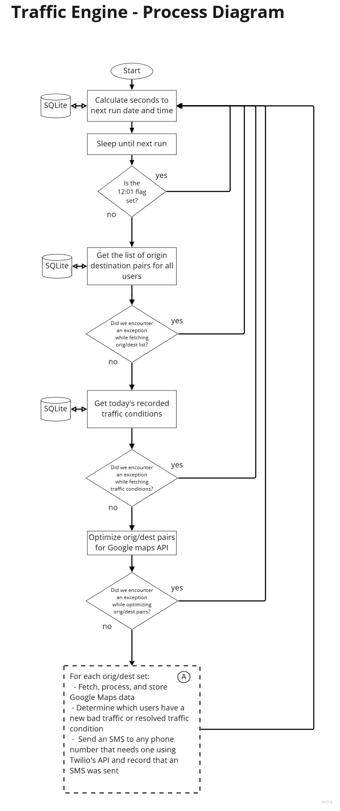
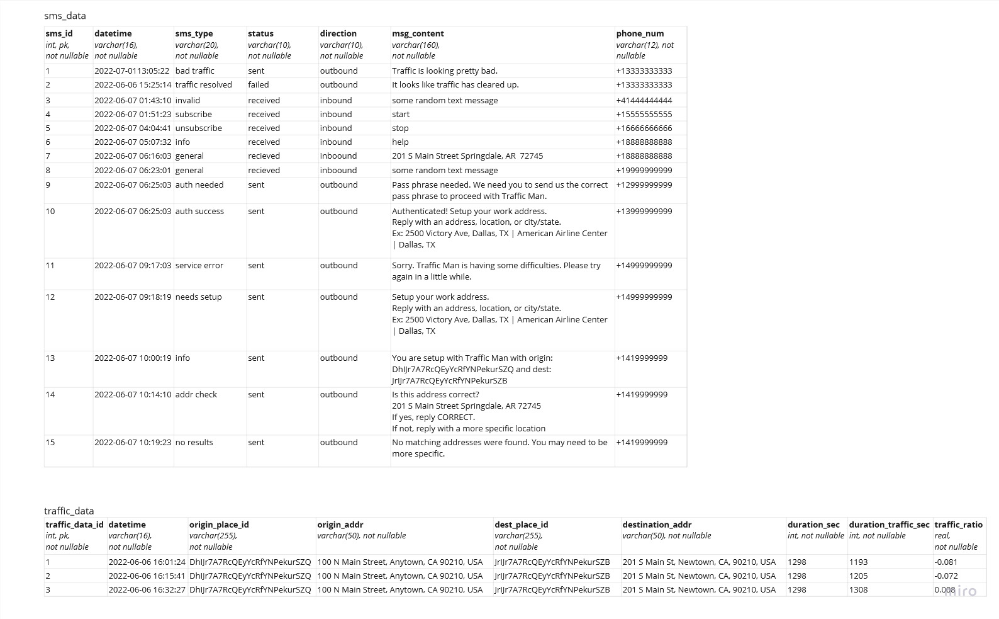

# traffic-man

## Overview
traffic-man is a dockerized application that checks for bad traffic conditions between two points using the Google Maps API on set days and times and sends SMS notifications to users when traffic conditions exceed a configurable threshold using Twilio.  
  
__Highlights__  
 - SQLite for storing phone numbers, traffic data, and SMS send history
 - Tested to run with both Python 3.9 and 3.10
 - Using docker and docker compose for build and deployment
 - Base image python:3.10.1-slim-bullseye
 - Uses the Google Maps Distance Matrix API (paid service, but has a free tier) to retrieve traffic conditions
 - Twilio's Messaging API provides the SMS messaging functionality (paid service)

## Prerequisites
 - Google account with Google Maps' Distance Matrix API enabled
 - Twilio account with SMS setup
 - A linux host machine with docker and docker compose installed to build and run the application image

## Quick start guide
 - Clone this repository to a machine with docker and docker compose installed
 - Create a .env file by copying and renaming the included .env-template
     - Replace all of the example values with your own.
     - You will have to get your Google API key and Twilio information from those accounts.
     - Adjust the `TRAFFIC_MAN_OVERAGE_PARAM` value to whatever you want. The default is set to 0.1, if not set in the .env file. A value of 0.1 will mean that a bad traffic SMS will be sent when the travel time with traffic is 10% more than the standard travel time. This value should be greater than 0, and should be expressed as a decimal number.
         - Once the bad traffic threshold is passed, traffic man will look for travel time to drop below 50% of the bad traffic threshold. If traffic man identifies that travel time has dropped below that threshold, it will send another SMS indicating that traffic conditions have improved.  
         __Example:__ If your overage parameter is set at 0.5, once the travel time with traffic exceeds 1.5 times the normal travel time, a bad traffic SMS message will send. Once the travel time with traffic drops below 1.25 times the normal travel time, a traffic resolved SMS message will be sent.  
    - Set the `TRAFFIC_MAN_CHECK_TIMES` variable. This indicates what times each day you want traffic man to check traffic conditions. If this variable is not set, traffic man will default to checking every 15 minutes starting at 4:00 PM (16:00), with the last check at 7:30 PM (19:30). Check times must be listed in the format `HH:MM` and need to be separated by a `|`.
    - Update the `TRAFFIC_MAN_HOLIDAYS` variable to include any holidays you want, so traffic man won't check traffic conditions on those days. These values should follow the formate `yyyy-mm-dd` and are separated by a `|`.
    - Change the `TRAFFIC_MAN_CHECK_DAYS` variable to set the days of the week you want traffic man to check traffic conditions. Days should be listed as lowercase full spellings separated by a `|`.
     - For more info on the .env file, see the [Environment variables section](#environment-variables)           

         __Note:__ Traffic man will only send one bad traffic SMS and one traffic resolved SMS per day. If traffic conditions oscillate back and forth several times around the overage parameter, traffic man will not continue to send SMS messages beyond one of each type.

 - Edit the Dockerfile
     - Edit `ENV TZ=America/Chicago` to match your timezone.
 - Edit docker-compose.yml
     - Optionally, you can edit or remove the `dns` directive. If you do not run a DNS server on your local network, you can probably just remove this.
 - Build the docker image
     - On the host machine that will run traffic man, turn on docker buildkit with `export DOCKER_BUILDKIT=1`
     - Move into the root of this project and run `docker build -t traffic-man:latest .` to build the docker image
 - Start the application
     - While still in the root of this project, run `docker-compose up -d` to start the traffic man container
     - A docker volume will be setup to perist the SQLite .db file and the log file
     - Run `docker ps` to verify that your container is running
 - Add phone numbers
     - Get sqlite command line tool
        - You will need to populate the phone_numbers table manually after traffic man has successfully started up.
        - To add phone numbers you will need to download the sqlite command line tool to your docker host machine from https://www.sqlite.org/download.html
        - You want the sqlite-tools-linux-x86-xxxxx.zip
        - Once the contents of the .zip file have been extracted you can access a sqlite databse by running this command in the same directory as the sqlite3 binary file `./sqlite3 path/to/sqlite.db`
     - Get place ids from Google
        - Google uses place ids as unique point identifiers in Google maps.
        - You can convert an address or city, state to a place id using Google Place ID Finder example here https://developers.google.com/maps/documentation/javascript/examples/places-placeid-finder
        - Once you have your place ids, keep them handy so you can include them in your insert statment
     - Insert a phone number with origin and destination
        - You will need root privileges to access the docker volume and sqlite db file of your traffic man container
        - Move into the directory that houses your sqlite3 binary file
        - If your docker host machine is running Ubuntu as its operating system, you can enter sudu su to become a root user (type `exit` when we are all done to go back to being your normal user)
        - To startup the sqlite command line tool while accessing the traffic man db file run the following command `./sqlite3 /var/lib/docker/volumes/traffic_man_1/_data/traffic_man.db`
        - Now you should be in the sqlite3 command line tool connected to the traffic man database. You can confirm that the data model has been created properly by typing `.tables` in the sqlite command line and pressing enter. This should print a list of tables to the console.
        - To insert your phone number, origin place id, and destination place id into the phone_numbers table and enable traffic man to check traffic conditiions and send SMS messages type the following command, entering in your values for the phone number and place ids, then press enter.
             - `INSERT INTO phone_numbers (phone_num, origin_place_id, dest_place_id, status, auth_status) VALUES ('+15555555555', 'ChIJS5dFe_cZTIYRj2dH9qSb7Lk', 'ChIJrQfILRJuToYRvaxp3fiLr6Q', 'sub', 'auth');`
             - Don't forget the `;`
             - You can confirm that the phone number was stored properly by running `SELECT * FROM phone_numbers;`
             - Exit the sqlite command line by typing `.exit` and pressing enter
     - That should be it. The origin and destination place ids you entered will have their traffic conditions checked by traffic man and SMS messages will be sent to the phone number stored in the same record.

## How it works  

__Architecture__  

   

 __Note:__ Future functionality will continue to add independently operating threads to the system which will also leverage the DB Engine and communicate via message queue. This approach was chosen to overcome concurrent read and write limitations with Sqlite. Ultimately, this approach may not have been necessary if Sqlite were configured to use WAL mode, but we are sticking with it anyway for now.
 &nbsp;
 &nbsp;  
 &nbsp;  
 

__Process diagram__  

   
   
 &nbsp;
 &nbsp;  

 __Data model__  
   
   
    
 &nbsp;

## Development and testing

### Setting up your dev environment

#### Envirionment variables
 - In the root of this project, create a .env file by copying and renaming the provided .env-template file. 
 - Edit your .env file, changing out the example values for yours.
    - You will get your Google API key, Twilio account SID, Twilio auth token from those respecitive accounts
    - The FROM_NUM variable will be the from phone number setup in your Twilio account. Phone numbers must follow the format of `+<country code><phonenumber including area code>` with no spaces or dashes.
    - Change the `TRAFFIC_MAN_ENV` variable to `dev`, so the log and db file will be stored in the project directory.  
        __Note:__ You will want to change this valud back to `prod` before starting your docker container in a production environment.
    - You can set the TRAFFIC_MAN_LOG_LEVEL variable to `debug` for more detailed logging information, or `info` for standard logging.
 - Before running traffic man, you need to export all of the variables you just set into your environment.
     - If you are using bash (or gitbash), run this command `export $(grep -v '^#' .env | xargs)`  __Note:__ The .env-template file is set to use eol=lf. If you copy this template file to create your .env file, make sure that it is using lf for end of line, not crlf. crlf will cause a \r character to be included with your environment variables when using a bash terminal (should only be an issue when running a bash terminal on Windows)
__Note:__ Never put your real API keys and phone numbers in the .env-template file. The .env file is included in the .gitignore file, and will not be committed to git history. .env-template is part of the poject, and will be commited to git history.

#### Install traffic man
 - It is recommended that you use python virtual environments to keep your dev environment clean.
 - With your desired python virtual environment active, navigate to the root of this project in your terminal of choice.
 - Run `pip install -e .[dev]` to install traffic man, its dependencies, and testing tools.
 - To start traffic man you can run `start-traffic-man` in your terminal.  
 __Note:__ This will run the full application and start printing log statements to the terminal. It will also call the Google Maps and Twilio APIs with the crendentials you provided, which could result in charges to your account.
     
#### Build the redis image and run the container
 - Leverage multi-stage build to create a separate redis image to use for development and testing that should behave exactly like it will in production.
 - Commands to build image and start redis container
    - `export DOCKER_BUILDKIT=1` 
    - `docker build --no-cache --target redis_stage -t traffic-man-redis-testing .`
    - Run container - assumes REDIS_PW environment variable is set in your dev environment
        - Gitbash in Windows: `docker run -itd -p 127.0.0.1:6379:6379 -e REDIS_PW=${REDIS_PW} traffic-man-redis-testing:latest  //bin//bash -c 'redis-server --requirepass ${REDIS_PW}  && bash'`
        - Linux: `docker run -itd -p 127.0.0.1:6379:6379 -e REDIS_PW=${REDIS_PW} traffic-man-redis-testing:latest  /bin/bash -c 'redis-server --requirepass ${REDIS_PW}  && bash'`

### Testing
 - Run the suite of unit tests and record test coverage with `coverage run --source=src -m unittest discover -v -s tests/unit`
 - Run the suite of integration tests and add coverage results to those captured during the unit test execution with `coverage run -a --source=src -m unittest discover -v -s tests/integration`
 - Generate an html report to see which modules and lines have test coverage by running the command `coverage html`
     - You can now navigate to the htmlcov directory that was created, and open the index.html file in your browser to see a report of test coverage and which lines of code still need to be covered (highlighted in red).
 - The .gitlab-ci.yml file included in this project is used to automate testing accross multiple environments on a private Gitlab server. This file could be modified for use on your own Gitlab server or gitlab.com, but will have no effect on Github.

## Release notes

### v1.0.0
 - Key Features
    - Allow each phone number/user to receive traffic man SMS messages based on their own independent origin and destination

 - Key Components
    - Storing information for each individual SMS message sent
    - DB engine structure to allow for multiple threads to read and write to SQLite without conflict (needed for the next steps)
    - New data model to support future enhancements
    - Origin/destination optimizer to minimize calls to the Google Maps API